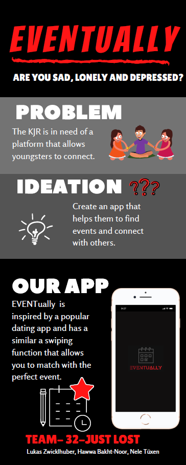

# Repository Team 32
Welcome to the Repository for the GXC Innovation Challenge of Team-32

Challenge 3: Munich City District Youth Association The future of youth participation: how to empower the youngsters?

Team Members: Hawwa Bakht-Noor; Lukas Zwicklhuber; Nele Tüxen

## About the Project

This project is about finding a way to solve the KJRs problem of empowering the youngsters.
Goal of the challenge is to find a way to improve the youth participation in the society by using a digital platform.

Outcome of the project is the idea of the app EVENTually. 
Eventually allows youngsters to connect with organizations and other people to find the perfect events and activities for them to participate in.

To find detailed information on the project and EVENTually follow the link to get to the repository's wiki:
https://github.com/gxc-international-innovation-challenge/gxc-team-32/wiki
